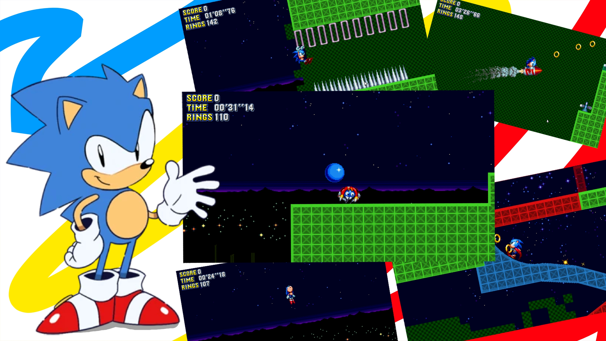

# HedgeGodot Engine

## License

All sprites and audios are property of Sega, you can't use them for comercial purpose.

The scripts are made by me and are under the MIT No Attribution license, no credits needed, but very appreciated.

## What is Hedgegodot?

HedgeGodot is a engine to help fans or developers develop games with a ready-to-basis, so many can learn to develop in Godot from this project, being to develop their own fan games, or independent games.

## GDScript, C#, Visual Script or GDNative?

My philosophy in this project is to schedule everything using GDScript (logical that you can change the programming language if you want, but then you will have to rewrite much of the code), because it is the language dedicated to Godot, although incomplete, I want to leave as native as possible, because it helps people better understand the code, so they can do whatever they want with the engine.

## Why Godot?

Godot is a tool:
- Free;
- Open-source;
- Multiplataform;

That is, accessibility is even greater for everyone, we can export to Windows, Mac/OS X, Linux, Android and IOS, and for being free, we can use with no problems, [Sonic Worlds](http://info.sonicretro.org/Sonic_Worlds) and [Core Engine](https://sonicfangameshq.com/forums/showcase/core-engine.852/) require the [Multimedia / ClickTeam Fusion](https://www.clickteam.com/clickteam-fusion-2-5) tool to operate (good tools, but are paid and the editor only has native support for Windows), my intention is to make as close as possible to [Sonic Worlds](http://info.sonicretro.org/Sonic_Worlds) and [Core Engine](https://sonicfangameshq.com/forums/showcase/core-engine.852/), for fans can make their games without support with support.

## The logo?

Use the logo as you want, i've just drawed for identification :P

## The community
Feel free to add features, let's grow the variety of Engines for Sonic together!!!